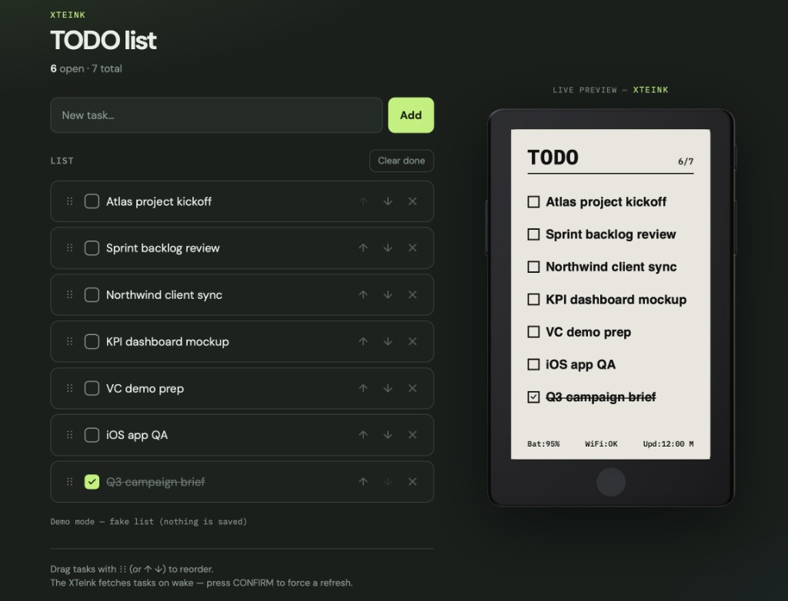
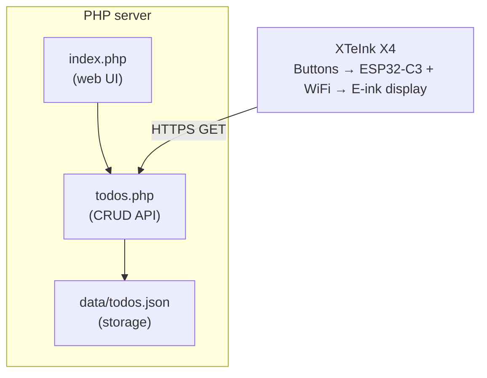

# XTeInk Todo List

E-ink todo list for the **XTeInk X4**, managed from a simple web UI.



## Features

- **Web UI** to add / check / edit / delete tasks
- **Auto sync**: the device fetches the list on each wake (~10 min)
- **Manual fetch** with the CONFIRM button
- **Pagination** with LEFT/RIGHT when there are more than 10 tasks
- Optional API token (firmware + server)

## Architecture



## Setup

### 1. Prerequisites

- Git
- Python 3 with PlatformIO
- A PHP 7.4+ web server with HTTPS

```bash
pip3 install platformio
git submodule update --init --recursive
```

### 2. Configure secrets

**Firmware** — copy the example, then set WiFi + API URL:

```bash
cp firmware/include/secrets.h.example firmware/include/secrets.h
```

```cpp
#define WIFI_SSID "YOUR_SSID"
#define WIFI_PASSWORD "YOUR_PASSWORD"
#define API_TODOS "https://example.com/xteink/todos.php"
#define API_TOKEN ""   // optional, must match server/config.php
```

**Server** — same idea:

```bash
cp server/config.example.php server/config.php
```

```php
return [
    'base_url' => 'https://example.com/xteink',
    'api_token' => '', // empty = authentication disabled
];
```

> `secrets.h`, `config.php`, and `data/todos.json` are gitignored.

For authenticated access, generate a long random token and configure the same
value in `server/config.php` and `firmware/include/secrets.h`. Do not use the
example strings from this README as real credentials.

The token is shared with the web UI and is therefore visible to anyone who can
open that UI. It protects the API from unauthenticated requests, but it is not a
replacement for user accounts or web-server access control. Use HTTPS and
restrict access to the UI when necessary.

### 3. Deploy the server

Upload the `server/` folder to your PHP host:

- `index.php` — web UI (`?demo=1` = fake list)
- `todos.php` — API
- `bootstrap.php` + `config.php`
- writable `data/` folder

```bash
cd server
mkdir -p data
chmod 775 data
```

The PHP process must be able to write to `data/`; the exact owner and group
depend on your hosting environment. The application creates `todos.json`
automatically. Avoid world-writable permissions such as `chmod 666`.

API smoke test:

```bash
curl https://example.com/xteink/todos.php
# with token:
curl -H "X-Api-Token: YOUR_RANDOM_TOKEN" https://example.com/xteink/todos.php
```

### 4. Flash the firmware

```bash
cd firmware
pio run -t upload
```

## Usage

### Web UI

1. Open `index.php` on your server
2. Add tasks
3. Check / edit (click the text) / delete
4. The XTeInk updates on the next fetch (or CONFIRM)

Demo mode (screenshots): `index.php?demo=1`

### Device buttons

| Button | Action |
|--------|--------|
| **LEFT / RIGHT** | Previous / next page |
| **BACK** | Jump back to page 1 |
| **CONFIRM** | Force refresh from the API |
| **POWER** | Sleep |

## Layout

```
xteink-todo/
├── docs/screenshot.png
├── firmware/
│   ├── include/secrets.h.example
│   ├── platformio.ini
│   └── src/main.cpp
├── server/
│   ├── bootstrap.php
│   ├── config.example.php
│   ├── index.php
│   ├── todos.php
│   └── data/.gitkeep
├── open-x4-sdk/            # submodule
└── README.md
```

## API (`todos.php`)

**GET** — list for the device / UI:
```json
{
  "todos": [{"id":"…","text":"…","done":false,"created_at":"…"}],
  "total": 2,
  "pending": 2,
  "updated_at": "…"
}
```

**POST** (JSON) — actions:
- `{ "action": "add", "text": "…" }`
- `{ "action": "toggle", "id": "…" }`
- `{ "action": "update", "id": "…", "text": "…" }`
- `{ "action": "delete", "id": "…" }`
- `{ "action": "clear_done" }`
- `{ "action": "reorder", "ids": ["…","…"] }`

Optional auth: send the shared token in the `X-Api-Token` header. A `?token=…`
query parameter is also supported for compatibility, but is discouraged because
URLs can be stored in browser history, server logs, and intermediary logs.

Leaving `api_token` empty disables authentication and makes the API publicly
accessible to anyone who can reach its URL.

## Troubleshooting

| Problem | What to check |
|---------|---------------|
| API reports that it cannot write `todos.json` | Check the owner and group of `server/data/` and make sure the PHP process can write to it. |
| Web UI returns `Unauthorized` | Confirm that `server/config.php` contains the expected token and that the UI is loaded from the same deployment. |
| Device shows `API error` | Check `API_TODOS`, HTTPS availability, and that the firmware token matches the server token. |
| Device cannot connect to Wi-Fi | Recheck `WIFI_SSID` and `WIFI_PASSWORD`, then use the serial monitor for connection messages. |
| PlatformIO cannot find the device | Run `pio device list`, reconnect the USB cable, and verify the selected upload port. |

## License

MIT — see [LICENSE](LICENSE).
